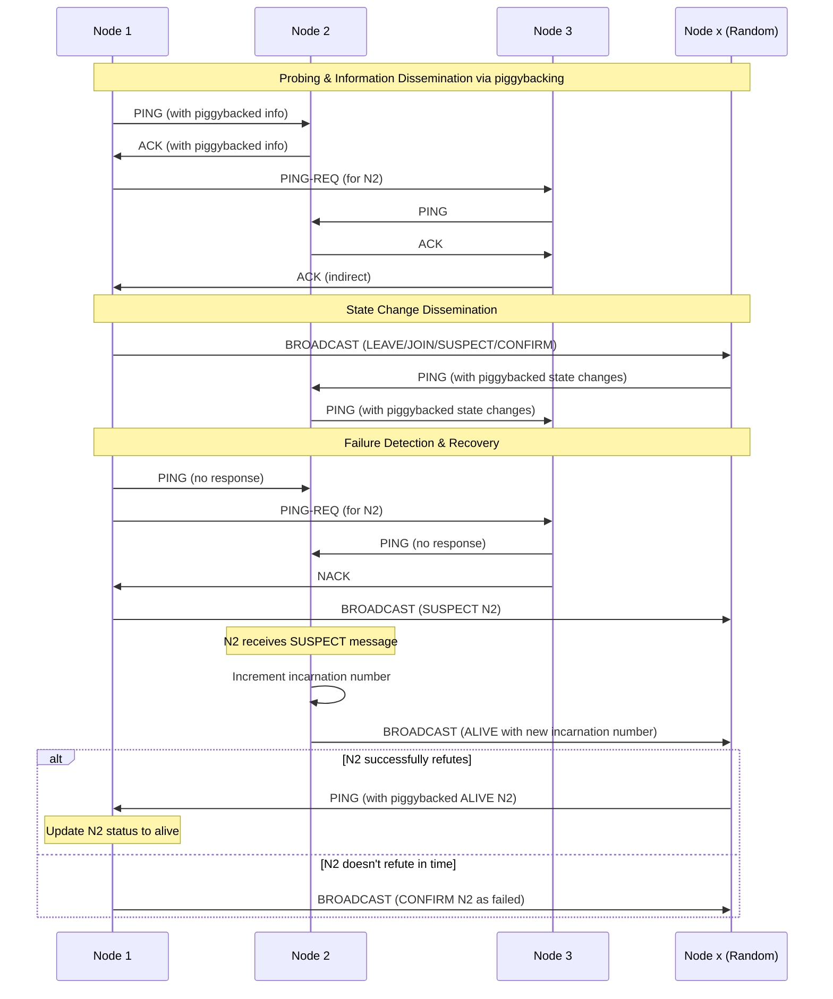

# Gossipod

[](https://github.com/TheDhejavu/gossipod/actions/workflows/CI.yml)


Asynchronous Scalable Weakly-consistent Infection-style Process Group Membership Protocol(SWIM) implementation written in Rust.

> [!WARNING]
> **Disclaimer:** This project is a work in progress and not yet production-ready.
> The codebase may contain bugs or incomplete features.
> Use with caution. Feedback and contributions welcome, Thanks!.


- Research Paper: [Swim](https://www.cs.cornell.edu/projects/Quicksilver/public_pdfs/SWIM.pdf)
- Examples: [Consistent Hashing](https://github.com/TheDhejavu/gossipod-examples/tree/main/hashring) | [QUIC](https://github.com/TheDhejavu/gossipod-examples/tree/main/quic) | [PING-PONG](https://github.com/TheDhejavu/gossipod/tree/main/examples)

## Proposed Key Features

- [x] Rust implementation for memory safety and performance
- [x] Asynchronous architecture using Tokio for efficient I/O operations
- [x] Simple API for easy integration into existing projects
- [x] Codec-based message serialization and deserialization for efficient network communication
- [x] Extensible design allowing for future custom behaviors 
- [x] Configurable failure detection parameters
- [x] Inbuilt Support for both TCP & UDP 
- [x] Pluggable Transport layer (QUIC, UDP)
- [ ] Basic encryption of data packets for secure communication
- [ ] Support `io_uring` runtime via Tokio
- [ ] Configurable Observability (Logging and Metrics)
- [ ] Implement `(SWIM:Basic)` + `(SWIM+Inf.)` + `(SWIM+Inf.+Susp.)` and extend to include features from [Lifeguard](https://arxiv.org/pdf/1707.00788) by Hashicorp Research


## SWIM implementation for Gossipod In a nutshell

Gossipod employs 3 types of messages: `PING`, `PING-REQ`, and `BROADCAST` (which includes `JOIN`, `LEAVE`, `SUSPECT`, `ALIVE`, and `CONFIRM` subtypes). The `PING` and `PING-REQ` messages are central to the system's failure detection mechanism base-off SWIM, facilitating constant state exchange by piggybacking information dissemination on this process. When a state change occurs, either through voluntary requests or regular failure detection, the system uses `BROADCAST` messages for random dissemination of this information. Each node in the network maintains an incarnation number, starting at zero, which can only be incremented by the node itself. This number is crucial for managing the node's state in other nodes' local membership lists and serves as a means to refute suspicions `(SWIM+Inf.+Susp.)` from other nodes. This design allows Gossipod to achieve efficient and resilient distributed state management and failure detection in a distributed or decentralized network, balancing the needs for up-to-date information, conflict resolution, and system reliability.

By Extension, [Lifeguard](https://arxiv.org/pdf/1707.00788) offers additional implementation features that are not yet incorporated into the current version of Gossipod which are fully supported by [Hashicorp memberlist](https://github.com/hashicorp/memberlist). I plan to integrate these features in a future release.


### Diagram



### Quick Demo
To see Gossipod in action, check out the [`./examples`](https://github.com/TheDhejavu/gossipod/tree/feat/configurable-support/examples) directory, which
includes a number of demos. Below you can run two different instances of gossipod specifiying different port address and node name

#### Node_1 as a standalone
```sh
> cargo run --example ping_node -- --name=NODE_1 --port=7948 
```

#### Node_2 with initial join to node_1
```sh
> cargo run --example pong_node -- --name=NODE_2 --port=7947 --join-addr=127.0.0.1:7948
```

# Gossipod API

### Creating a new Gossipod instance

```rust
let config = GossipodConfigBuilder::new()
    .name(&args.name)
    .port(args.port)
    .addr(args.ip.parse::<Ipv4Addr>().expect("Invalid IP address"))
    .probing_interval(Duration::from_secs(1))
    .ack_timeout(Duration::from_millis(500))
    .indirect_ack_timeout(Duration::from_secs(1))
    .suspicious_timeout(Duration::from_secs(5))
    .network_type(NetworkType::LAN)
    .build()
    .await?;

let gossipod = Gossipod::new(config).await?;
```

#### With custom node metadata

```rust
#[derive(Clone, Debug, Serialize, Deserialize, PartialEq, Eq, Hash)]
struct Metadata {
    region: String,
    datacenter: String,
}

impl NodeMetadata for Metadata {}

let metadata = Metadata { 
    region: "aws-west-1".to_string(),
    datacenter: "dc1".to_string(),
};

let gossipod = Gossipod::with_metadata(config, metadata).await?;
```

## Example Usage

Here's a basic example of how to use Gossipod in your application:

```rust
// Configuration
let config = GossipodConfigBuilder::new()
    .name(&args.name)
    .port(args.port)
    .addr(args.ip.parse::<Ipv4Addr>().expect("Invalid IP address"))
    .probing_interval(Duration::from_secs(1))
    .ack_timeout(Duration::from_millis(500))
    .indirect_ack_timeout(Duration::from_secs(1))
    .suspicious_timeout(Duration::from_secs(5))
    .network_type(NetworkType::LAN)
    .build()
    .await?;

// New instance
let gossipod = Arc::new(Gossipod::new(config.clone()).await?);

// Start Gossipod
tokio::spawn(gossipod.clone().start());

// Wait for Gossipod to start
while !gossipod.is_running().await {
    time::sleep(Duration::from_millis(100)).await;
}
```

## Reference
- [SWIM: Scalable Weakly-consistent Infection-style Process Group Membership
Protocol ](https://www.cs.cornell.edu/projects/Quicksilver/public_pdfs/SWIM.pdf)
- [Lifeguard: Local Health Awareness for More
Accurate Failure Detection](https://arxiv.org/pdf/1707.00788)
- [Hashicorp Membership implementation](https://github.com/hashicorp/memberlist)