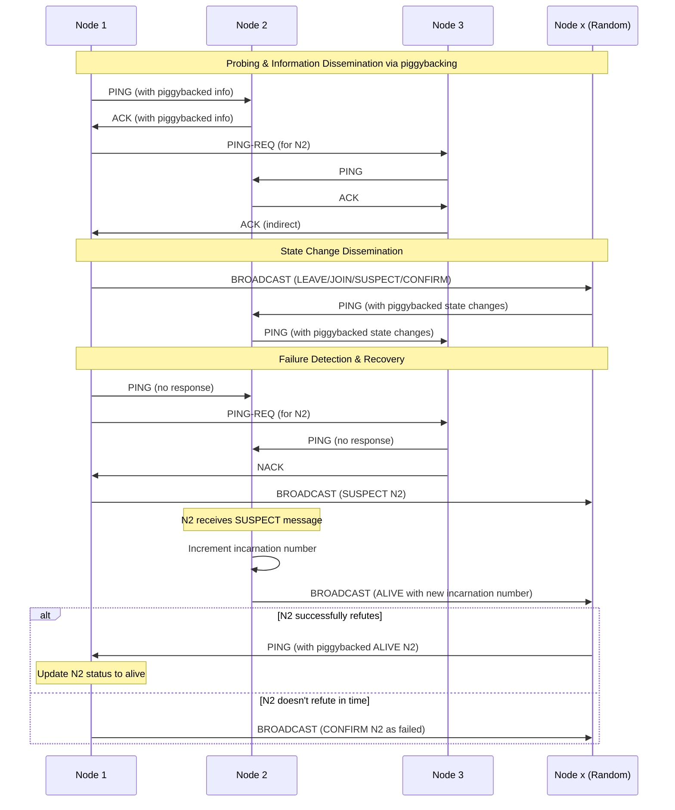

# Gossipod

[](https://github.com/TheDhejavu/gossipod/actions/workflows/CI.yml)


An Asynchronous SWIM protocol implementation written in Rust, providing out-of-the-box and extendable transport-layer communication via TCP and UDP based-off [SWIM Protocol Paper](https://www.cs.cornell.edu/projects/Quicksilver/public_pdfs/SWIM.pdf)

> [!WARNING]
> **Disclaimer:** This project is a work in progress and not yet production-ready.
> The codebase may contain bugs or incomplete features.
> Use with caution. Feedback and contributions welcome, Thanks!.

## Proposed Key Features

- Rust implementation for memory safety and performance
- Asynchronous architecture using Tokio for efficient I/O operations
- Support `io_uring` runtime via Tokio
- Simple API for easy integration into existing projects
- Codec-based message serialization and deserialization for efficient network communication
- Configurable failure detection parameters
- Inbuilt Support for both TCP and UDP protocols 
- Robust and Configurable Observability (Logging and Metrics)
- Basic encryption of data packets for secure communication
- Extensible design allowing for future custom behaviors 
- Implement `(SWIM:Basic)` + `(SWIM+Inf.)` + `(SWIM+Inf.+Susp.)` and extend to include features from [Lifeguard](https://arxiv.org/pdf/1707.00788) by Hashicorp Research


## SWIM implementation for Gossipod In a nutshell

Gossipod employs 3 types of messages: `PING`, `PING-REQ`, and `ANNOUNCE` (which includes `JOIN`, `LEAVE`, `SUSPECT`, `ALIVE`, and `CONFIRM` subtypes). The `PING` and `PING-REQ` messages are central to the system's failure detection mechanism base-off SWIM, facilitating constant state exchange by piggybacking information dissemination on this process. When a state change occurs, either through voluntary requests or regular failure detection, the system uses `BROADCAST` messages for random dissemination of this information. Each node in the network maintains an incarnation number, starting at zero, which can only be incremented by the node itself. This number is crucial for managing the node's state in other nodes' local membership lists and serves as a means to refute suspicions `(SWIM+Inf.+Susp.)` from other nodes. This design allows Gossipod to achieve efficient and resilient distributed state management and failure detection in a distributed or decentralized network, balancing the needs for up-to-date information, conflict resolution, and system reliability.

By Extension, [Lifeguard](https://arxiv.org/pdf/1707.00788) offers additional implementation features that are not yet incorporated into the current version of Gossipod. I plan to integrate these features in a future release i like the idea of constantly pushing and pulling of state at interval to randomly selected `k` nodes. 

During my experiments with the [Hashicorp memberlist](https://github.com/hashicorp/memberlist), I observed that this approach seems to promote faster membership convergence compared to relying solely on the standard piggybacked method for information dissemination. The regular intervals of state exchange appear to accelerate the process of achieving state convergence across the network.


### Diagram



### Usage Sample

```rust
#[tokio::main]
async fn main() -> Result<()> {
    let config = GossipodConfigBuilder::new()
        .name("node_1")
        .port(8080)
        .addr(Ipv4Addr::new(127, 0, 0, 1))
        .ping_timeout(Duration::from_millis(2000))
        .build()
        .await?;
    
    let mut gossipod = Gossipod::new(config).await?;

    // Spawn a task to run the Gossipod instance
    let gossipod_clone1 = gossipod.clone();
    tokio::spawn(async move {
        if let Err(e) = gossipod_clone1.start().await {
            error!("[ERR] Error starting gossipod: {:?}", e);
        }
    });

    // wait for Gossipod to start
    while !gossipod.is_running().await {
        time::sleep(Duration::from_millis(100)).await;
    }

    info!("Members: {:?}", gossipod.members().await?);
    info!("[PROCESS] Gossipod is running");

    // Listen for Ctrl+C or SIGINT
    let gossipod_clone2 = gossipod.clone();
    tokio::spawn(async move {
        tokio::signal::ctrl_c().await.expect("Failed to listen for event");
        info!("Signal received, stopping Gossipod...");
        gossipod_clone2.stop().await.expect("Failed to stop Gossipod");
    });

    for _ in 0..10 {
        if !gossipod.is_running().await {
            break;
        }
        time::sleep(Duration::from_secs(1)).await;
    }

    // Await until Gossipod is stopped either by signal or loop completion
    while gossipod.is_running().await {
        time::sleep(Duration::from_millis(100)).await;
    }o

    info!("[PROCESS] Gossipod has been stopped");
    Ok(())
}
```
### Quick Demo
To see Gossipod in action, check out the `./examples` directory, which
includes a number of demos. Below you can run two different instances of gossipod specifiying different port address and node name

#### Node 1
```sh
> cargo run  --example default_gossipod -- --name=node_1 --port=8080
```

#### Node 2 with initial join
```sh
> cargo run  --example default_gossipod -- --name=node_2  --port=7070 --join-addr=127.0.0.1:8080
```

## Reference
- SWIM: Scalable Weakly-consistent Infection-style Process Group Membership
Protocol [https://www.cs.cornell.edu/projects/Quicksilver/public_pdfs/SWIM.pdf]
- Lifeguard: Local Health Awareness for More
Accurate Failure Detection [https://arxiv.org/pdf/1707.00788]
- Hashicorp Membership implementation [https://github.com/hashicorp/memberlist]